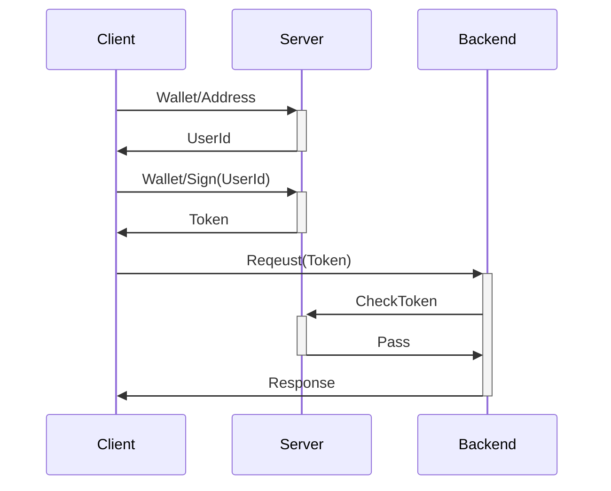

# Web3Auth

Web3 User Authentication Service



## Supported wallets

- solana/phantom

## Login step

1. POST /getUserId
   ```
   curl -X 'POST' \
    'http://127.0.0.1:3000/getUserId' \
    -H 'Content-Type: application/json' \
    -d '{
      "address": "5oNDL3swdJJF1g9DzJiZ4ynHXgszjAEpUkxVYejchzrY"
    }'

   {
     "result":"c9fe7bf01a33e35c"
   }
   ```
2. POST /getUserToken
   ```
   curl -X 'POST' \
    'http://127.0.0.1:3000/getUserToken' \
    -H 'Content-Type: application/json' \
    -d '{
      "address": "7iCzEsN1xrV9gZoWMvUaWKhAhy1Cqm9iAeVAmJVThCqV",
      "uid": "c9fe7bf01a33e35c",
      "signature": "52VJa6DBU92aMLkm5hVwJDNqQsjzKR3AZvqsX2EdAbtZVfMkzdLcS3oAdGbWP1c29wxYuPZkUNoNm6Eg9Mc7yGJD"
    }'

   {
     "result": "bec012cc4eeefe921fb5e944d851efa19a768638d1d6ec6620ed1a07f4067b026b773f616226fb3822618292597c27b6d6bcf8e0c7d542f5e8e288aec067c448"
   }
   ```
3A. POST /checkUserToken
   ```
   curl -X 'POST' \
    'http://127.0.0.1:3000/checkUserToken' \
    -H 'Content-Type: application/json' \
    -d '{
      "token": "bec012cc4eeefe921fb5e944d851efa19a768638d1d6ec6620ed1a07f4067b026b773f616226fb3822618292597c27b6d6bcf8e0c7d542f5e8e288aec067c448"
    }'

   {
     "result":{
       "address":"7iCzEsN1xrV9gZoWMvUaWKhAhy1Cqm9iAeVAmJVThCqV",
       "uid":"c9fe7bf01a33e35c"
     }
   }
   ```
3B. GET /checkUserToken
   ```
   curl -X 'GET' \
    'http://127.0.0.1:3000/checkUserToken' \
    -H 'Content-Type: application/json' \
    -H 'token: bec012cc4eeefe921fb5e944d851efa19a768638d1d6ec6620ed1a07f4067b026b773f616226fb3822618292597c27b6d6bcf8e0c7d542f5e8e288aec067c448'

   {
     "result":{
       "address":"7iCzEsN1xrV9gZoWMvUaWKhAhy1Cqm9iAeVAmJVThCqV",
       "uid":"c9fe7bf01a33e35c"
     }
   }
   ```

## Debug

```

// 使用浏览器钱包 Phantom 签名消息
const script = document.createElement('script');
script.src = 'https://cdn.jsdelivr.net/npm/base-58@0.0.1/Base58.min.js';
script.onload = async () => {
    console.log('bs58 库已加载！');

    // 检查 Phantom 钱包是否存在
    if (!window.solana) {
        console.error('请安装 Phantom 钱包！');
        return;
    }

    try {
        // 连接 Phantom 钱包
        await window.solana.connect();
        console.log('已连接钱包：', window.solana.publicKey.toString());

        // 签名消息
        const message = `c9fe7bf01a33e35c`;
        const encodedMessage = new TextEncoder().encode(message);
        const signedMessage = await window.solana.signMessage(encodedMessage, "utf8");

        // 使用 bs58 将签名转换为 Base58 字符串
        const signatureBase58 = Base58.encode(signedMessage.signature);
        console.log('Signed Message (Base58):', signatureBase58);
    } catch (error) {
        console.error('Error signing message:', error);
    }
};
document.head.appendChild(script);
```
