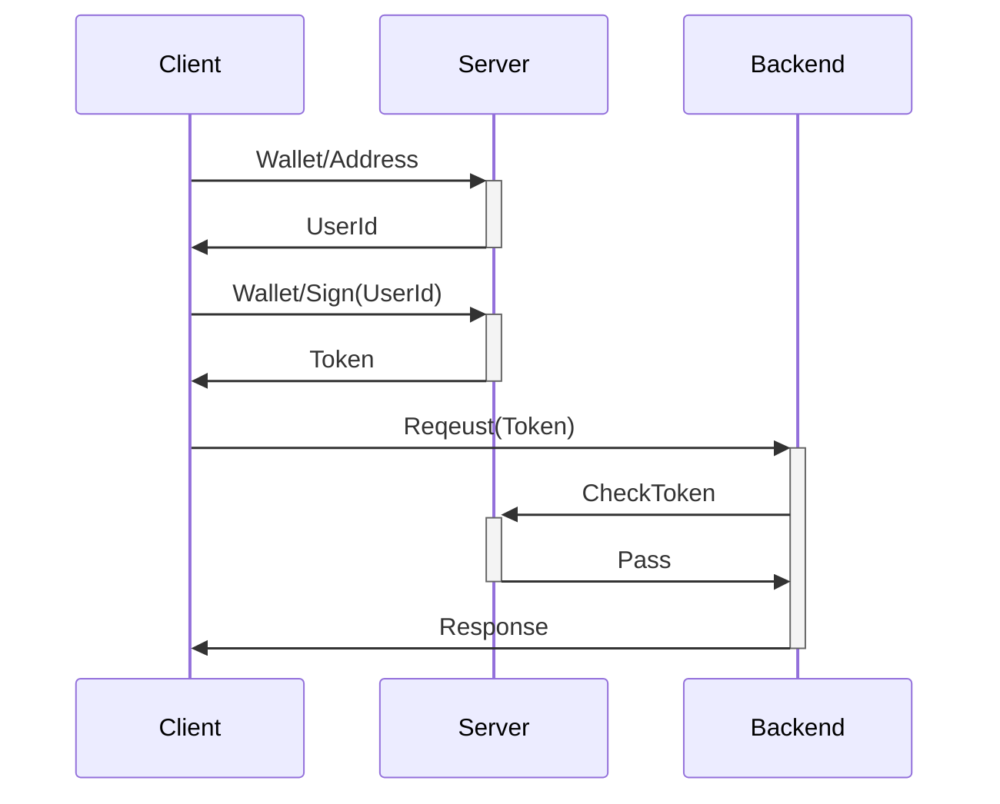

# Arch

```mermaid
sequenceDiagram
  Client ->>+ Server: Wallet/Address
  Server ->>- Client: UserId
  Client ->>+ Server: Wallet/Sign(UserId)
  Server ->>- Client: Token

  Client ->>+ Backend: Reqeust(Token)
  Backend ->>+ Server: CheckToken
  Server ->>- Backend: Pass
  Backend ->>- Client: Response
```